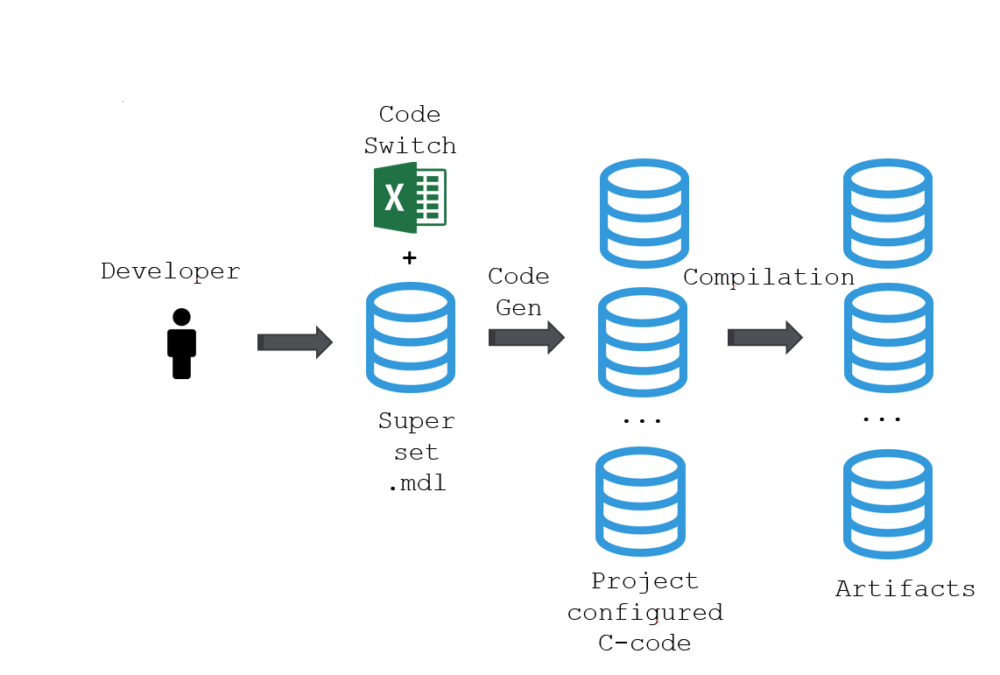
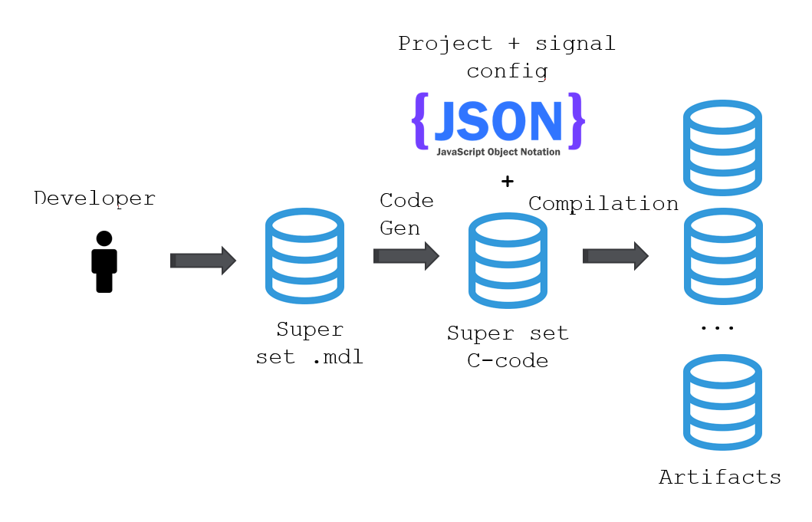
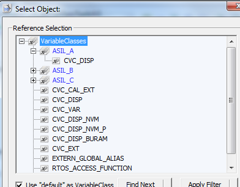
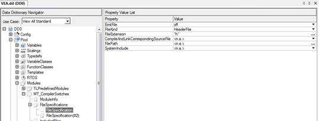
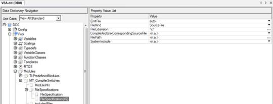
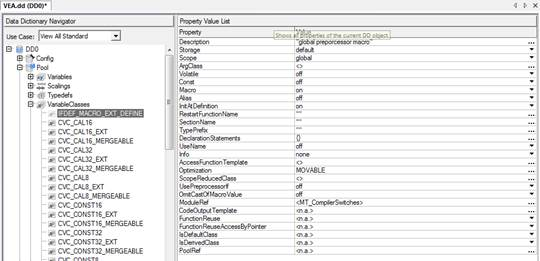
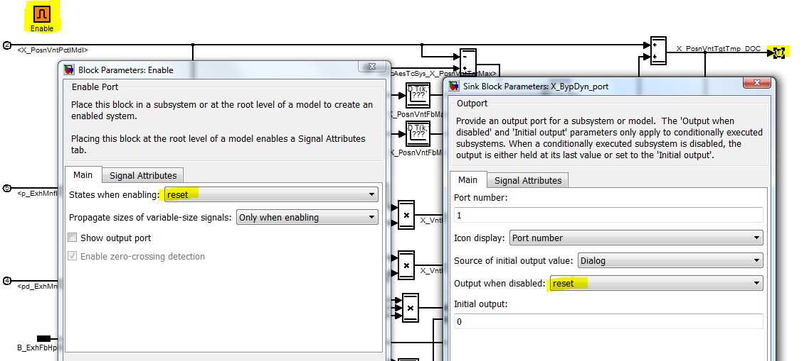

# Introduction to PCC Build System's documentation

## Target

- Improved build speed
- Easier integration of code from other sources than TargetLink
- Improved quality
  - Design documentation
  - Unit tests
  - Better code structure
  - Better target code (no postprocessing, all code explicitly assigned to memory areas)

## Overview

The big conceptual change is to move the variability from the code generation stage to the compilation stage.

Build a superset c-code, which can be configured via preprocessor directives.

As the code generation step takes a significant part of the build time, distributing this step to the time of commit, instead of when building the SW, will reduce build time. Only generating one set of c-code, instead of one per variant, will further reduce build time.

The unit c-code also has a unit metadata file (in json-format) which the build system will use. This metadata file acts as a unit code generator abstraction. I.e. the metadata file contains all information needed by the build system and it is independent from how the unit code was created. This will make integration of hand written c-code much easier.

## Summary of changes

This section describes the changes made to the build system (Data dictionary, scripts, configuration files, etc.), but not the changes needed to be done in the model files. These changes are described in [model_changes](model_changes.md)

1. No TargetLink classes uses pragma-directives. These are replaced with header files. The header files are different per supplier and includes the supplier specific header files. When the project is set up in the version control system, the correct header for the supplier are included with externals. I.e. the configuration is done in the version control system. This means that no post processing of c-files are necessary, which reduces build time.

2. Data dictionary changes
    - Pragma directives replaced by includes (see above)
    - Removal of all datatype sizes in the classes (i.e. CVC_DISP replaces CVC_DISP8, CVC_DISP16 and CVC_DISP32). TargetLink 3.3 groups variable declarations by size without different classes.
    - New NVM-ram types are added
    - Removed old legacy classes which should no longer be used
    - Dependability classes are added, and postprocessing of dependability code is removed.

    Scripts are provided to update the models with new the classes. The Dependability classes are located in variable class groups, to make creating models easier (less clutter in the target link class dialog).

    

3. Data dictionary additions for code switch replacement
    - Create a file to be included with the preprocessor defines for the configuration, by creating a new module in DD0/Pool/Modules. The name of the module will be the name of the header-file included in the c-files. I.e. MT_CompilerSwitches in the example below.
    - Create a new file specification in the module (by right clicking "file specifications" and selecting "Create FileSpecification". Fill in the values below.

    

    - Create another a new file specification in the module (by right clicking "file specifications" and selecting "Create FileSpecification". Fill in the values below.

    

    - Create a new variable class (by right clicking "Variable Class" and selecting "Create Variable Class". Fill in the values below, but add MERGEABLE in the "Optimization" Option.

    

4. No models are needed for VcExt*, VcDebug*. C-code and A2L-files are generated directly, which saves build time.

5. Variables are declared in the units which writes to them, with the exception of variables in the supplier interface. I.e.
    - VcIntVar is removed.
    - Classes of unit outputs in the models are changed from CVC_EXT to CVC_DISP. Scripts are provided to modify the models.

6. All units are checked-in together with it's c-code, and a json unit-definition file. See [unit_config](unit_config.md) for structure of that file. This leads to code generator independence and vastly improved build time, as the most time consuming step is distributed.

7. New project configuration file, see [project_config](project_config.md)
    - Config separated in a global config file, and one project specific file.
    - More flexibility for different file structures (config, rather than code change)

8. Interface checks are introduced to guarantee that interfaces are consistent before build. Increases quality and reduces build time.

9. Improved maintainability by
    - A more modular design.
    - Documentation of the build system.
    - Unit tests for the build system.

10. A new temp-model is generated to move the TL-outport to the subsystem where the signal is created. This is needed to be able to remove the unused outports from the generated c-code, and at the same time have the possibility to create a test harness. Is there a way to avoid this without using the TL-DD or making temp models?

## Limitations in TL3.3

When using TargetLink 3.3 and preprocessor directives, there are some limitations of what can be used in subsystems under these directives.

1. Enabled subsystems cannot use the reset states option.
2. The outports of enabled subsystems cannot use the reset when disabled option.

After discussion with dSpace, they are considering removing the above mentioned limitations, in TL 4.4 or later. This needs to be confirmed with dSpace.

Another issue is that the TargetLink code generation optimizer considers preprocessor ifs as any other control flow (e.g. an ordinary if statement). Enabling the control flow code generation optimization (the MOVEABLE optimization in the class), can lead to the removal of code, calibration data or measurement variables when using preprocessor ifs.

See [model_changes](model_changes.md) for workarounds for these limitations.
