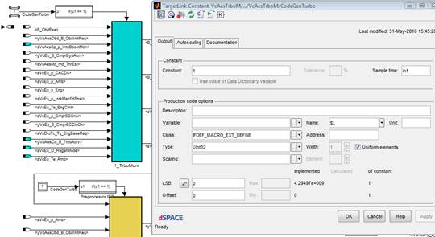

# Necessary Model Changes

This section describes the necessary model changes that has to be done for the new build environment to work. Most of these changes will be automated by model conversion scripts.

## Replacement of the VCC Codeswitch blocks

1. Add a constant of the type you defined above (`IFDEF_MACRO_EXT_DEFINE`) and a TargetLink pre-processor IF block

   

2. The pre-processor IF block is found here:

   

3. Add a Simulink action port to the subsystem

   

4. Connect the TargetLink pre-processor IF block to the action port of the subsystem

   

## Use of the VCC Codeswitch blocks as constants

TargetLink does not accept using the same pre-processor define for both pre-processor ifs and as constants. The workaround is to create a new define, which is set to the original define in the `LocalDefs.h` file created by the code-generation scripts.


`VcAesAir_OPortMvd_LocalDefs.h`:

```c
#include "VcCodeSwDefines.h"

#define Vc_Aes_B_CodeGenDsl_CN (Vc_Aes_B_CodeGenDsl)
```

## Modification of ts datastore blocks

The datastore block for sampling time, *ts*, must be modified so that different time constants can be used when building the superset c-code for different projects.

Change the class of the datastore block to *"EXTERN_GLOBAL_ALIAS"* and fill in the name of the constant defining the sampling time in the *Name* field.

The build scripts generates a header file which defines the correct time constant value.


## Declaration of output variables in unit

The `VcIntVar.c` file is removed, the unit producing a signal should declare it. This avoids interface integration issues and saves build time. **NB: Model change required**

- TL-Class for outports need to be changed to `CVC_DISP` in all models.
- A script is written which modifies all outports to `CVC_DISP`.

## Addition of new dependability TL-classes

Dependability classes are added, and postprocessing of dependability code is removed. Scripts are provided which automatically changes the classes of a model.

## Enabled subsystem outports

Subsystems with any subsystem parent, which have a TL-preprocessor switch, cannot have a "reset-port" state. See below for workarounds.

- The scripts converting the models will detect if the reset states option is used, and will not use a preprocessor-if for that subsystem. This will lead to increased RAM/ROM usage. It is recommended to refactor the model (split into several models), if this is a possibility.
- All outports with the reset when inactive option enabled, will have that option disabled by the conversion script. This will be shown in the logfile. The designer needs to consider if this change is acceptable and if not, the following design workaround is recommended.

   

## Other workarounds

The workaround for the optimization problem is to remove the MOVEABLE optimization when the new build system is introduced. This will bring us back to the same behavior as we had when running TL 2.1.5.

This will make it easier to understand how the target code works, as it will behave as in simulink. Furthermore, it will be easier to predict maximum CPU-load. The downside is that it will cost 0.1% extra CPU load, when measured last time.
