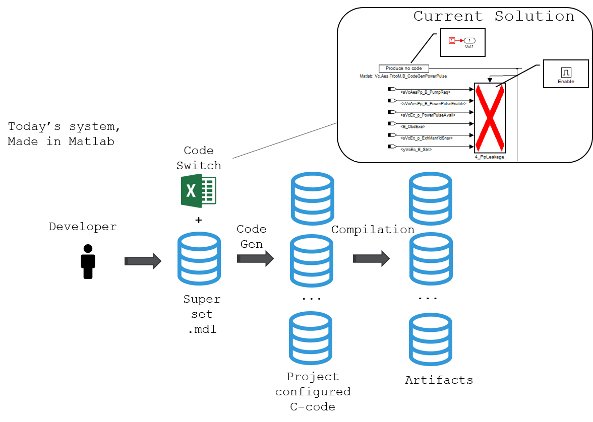

# powertrain_build General Code Introduction

[TOC]

<!--:powertrain_build:-->

## Why is powertrain_build used?

The software is built using TargetLink, which generates c-code from Simulink
models. Some models are used in multiple projects while others only serve for one project.

To make things easier to understand, let's say we want to produce a software
for ABC_123 (fake car model) which handles the diesel.

## Software generation before powertrain_build

1) Gather all models used in ABC_123.
2) Some models are used in several projects, therefore, we need to process those
models and remove all non-ABC_123 parts. To save memory and avoid using the
wrong software, matlab scripts is responsible for cutting out useless parts of
the model.
3) Generate c-code using TargetLink.
4) Compile.

Such process had to be done every time we wanted software and we have up to 11
projects to maintain, which could take a while.

## Software generation after powertrain_build

powertrain_build uses preprocessor blocks in the models, which means that the generated
code has "#ifdef SOME_VAR" inside. It enables to switch between projects using
variales, which means we can generate code for each model and store them in ./Models/.

1) Gather all c-/h-files used in ABC_123.
2) Set variales according to codeswitch documents.
3) Compile.

## Summary

Before powertrain_build, we had to generated code for each model (after modifying them
through matlab scripts) for each projects and then compile. Now the latest
version of the code is already in the repo, we just need to gather files, set
variables and compile.

## How to start with powertrain_build

To get familiar with powertrain_build, build.py is a good start since it contains all
modules. Four important modules could also help you understand powertrain_build better:
build_proj_cfg, unit_cfg, feature_cfg, signal_interface.

## build_proj_cfg

This module is used to read ./Projects/<project_name>/Config/ProjectCfg.json
and ./ConfigDocuments/BaseConfig.json, which provides configuration
files location. The location of Base_Config is also stored in ProjectCfg.
build_proj_cfg also provides methods of gathering information for other modules.

## feature_cfg

feature_cfg module is also called the codeswitch module. It reads from
./ConfigDocuments/SPM_Codeswitch_Setup*.csv and provides methods for
retrieving the currently used configurations of a unit. The first
row of SPM_Codeswitch_Setup*.csv lists all projects and the first column
lists codeswitch names. The values under each project states whether the
corresponding codeswich is active in this project.

## unit_cfg

The model list of a project is in ./Projects/<project_name>/local_cof/raster.json.
Then unit_cfg reads unit definitions from models from the model list
(/Models/<model_name>/pybuild_cfg/<model_name>.json). This module also
provides methods to retrieve any unit definition, such as inports and outports,
of a unit and all existing units.

## signal_interface

This module gets supplier interface of the project from
./Projects/<project_name>/Config/ActiveInterfaces/. It provides methods
of checking signal interfaces consistency between Supplier and VCC SW. It
also reads inport/outport information from all units in raster and checks
internally inports/outports consistency between VCC SW-units

## Why powertrain_build, whats the advantages?

A Continuous Integration (CI) Build System needs to test all configurations
where a TargetLink model is used.

- It's faster
  - There is more parallelization of jobs in the CI system, so its faster.
  - Code generation is moved to the developers PC
  - Code generation is done once for all projects using pre-processor directives.
  - C code review is now possible in gerrit!
  - The total build time on a software is 15 minutes for all 9 projects
- powertrain_build adds signal consistency checks.
- Unit tests of the Build system is introduced
  - So its quality assured
  - Its easy to learn for new employees.
- powertrain_build creates new variable classes with unique code decorations
  - This means that post processing C code is not necessary.
  - This means that ASIL classed variables get declared at the source.
  - This means that we can optimize memory at compilation, and save memory in GEP3 through short addressing different variable classes.
  - This means we have control of all build steps
  - This enables us to use the same models in more than 2 different suppliers, for instance SPA2's Core System Platform.
  - powertrain_build thus fixes incorrect handling of NVM variables.

### Legacy, how it used to be

The old system was scripted in Matlab.
The code was not re factored, but build
upon for many years. Hence the complexity of the code was high.
As seen in the figure below, the models used code switches to generate different code for different projects.
The Legacy Build process can be followed in this sharepoint
site:

### What is it

- Made in Python.
- Instead of Code Switches in the TargetLink models, there are C Pre Processor
  directives. In this way, we will have super set C code representing the super
  set Simulink models.
- Unit tests of build scripts as well as html documentation.
- Signal consistency checks through creating JSON files of the code

### How powertrain_build is used in different targets

#### vcu/hp

#### vcu/hi

#### ECM

### TargetLink Limitations

- dSPACE delivers removal of limitation in TargetLink release 2019B, first said
  to be delivered 2018B. These options gives code generation errors:
  - Enabled subsystems, which reset the states when enabling them.
  - Out ports which are reset when disabling a subsystem, which are used in subsystems under a pre-processor block
- Solution of TargetLink limitation is refactoring of models

### powertrain_build dependencies

Python module dependency visualization from pydeps,
[https://github.com/thebjorn/pydeps](https://github.com/thebjorn/pydeps) looks like this:

#### How powertrain_build generates a SPA2 service

