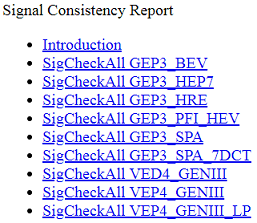
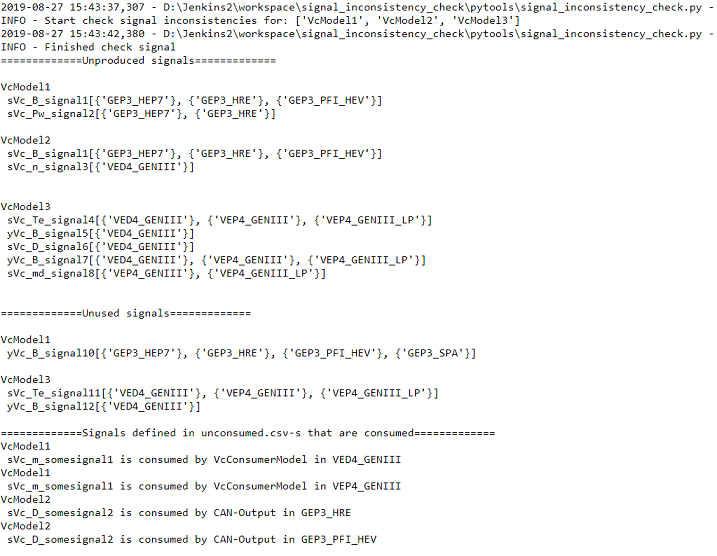
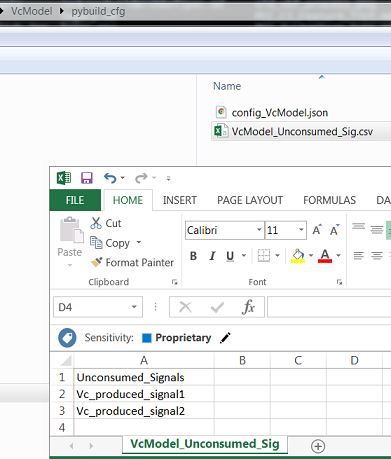

# Signal inconsistency in check (none gating)

---------------------------------------------

[TOC]

## Introduction

Signal inconsistency check will be performed on all changes containing .mdl
files. Reports are created and uploaded to artifactory. One report for each
project, showcasing information about signals relevant for specific project.

>

Inconsistencies that will be gating upon (listed below) will also be displayed
in Jenkins log.

- Unproduced inports
- Produced but not used outports
- Signals added to \<model>\_Unconsumed_Sig.csv

>

## Checks

Following checks will be performed on models in gerrit change

1. Unproduced inports
     - Signals that are configured to be consumed by model but are not produced
     internally (models) and/or externally (interface list).
1. Produced but not used outports
     - Signals that are configured to be produced by model but does not have
     consumer internally (models) and/or externally (interface list).
1. Signals added to \<model>\_Unconsumed_Sig.csv
     - Signals that are defined to **not have consumer** but **is consumed**
     internally (models) and/or externally (interface list)

## \<model\>\_Unconsumed_Sig.csv

For "Produced but not used inports" that are intended for consumption after
point of merging to master there exist possibility to disable check.

1. Create pybuild_cfg/\<model\>\_Unconsumed_Sig.csv.
1. Add Header "Unconsumed_Signals" and populate with produced signals
(outports only) you like to omit.

>

## Running checks and creating reports before pushing to gerrit (optional)

Please install pytools before running signal inconsistency locally. See
[powertrain_build and PyTools instruction](./powertrain_build.md)

```bash
py -3.6 -m pytools.signal_inconsistency_check -m VcModel1 -r
```

Multiple model

```bash
py -3.6 -m pytools.signal_inconsistency_check -m VcModel1 VcModel2 VcModel3 -r
```

Running without report creation

```bash
py -3.6 -m pytools.signal_inconsistency_check -m VcModel1 VcModel2 VcModel3
```

## Limitations

- Project specific report E.g SigCheckAll_\<PROJECT\>.html will only show
information about signals configured to be used in project "PROJECT".
- Reports does not display information about check 3. This will only be
displayed in build logs.
- Jenkins/script log does not display information about none gating
inconsistencies E.g
  - "Outports that are generated more than once in the listed
    configuration(s)"
  - "Inports that have different variable definitions than the producing
    outport"
  - "In-/Out-ports that have different variable definitions than in the
    interface definition file."
